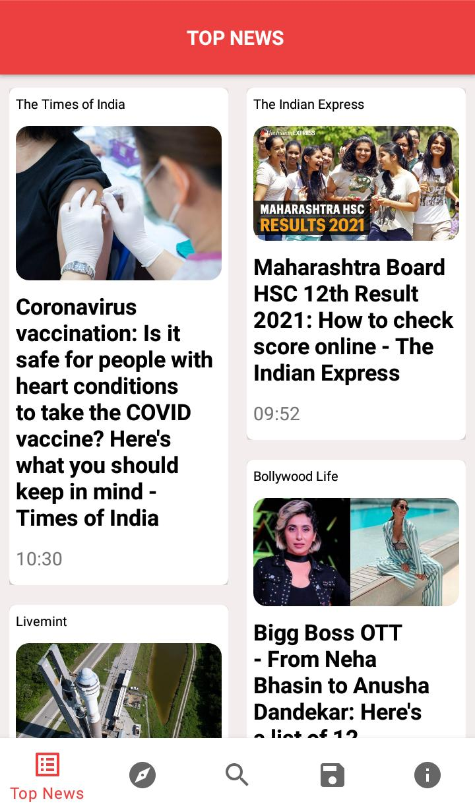
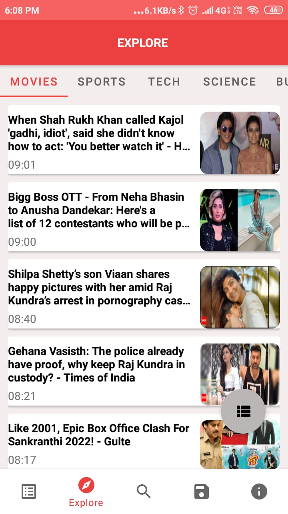

 <h1 align="center"> NEWSESY </h1>
 Newesy is news app which uses NewsAPI to fetch news.The main aim of this app was to learn  Modern Android Architecture (MVVM).

## Features

<ul>
<li> App brings you latest news from a wide range of sources
<li> Clean user interface allows user to navigate different news sections easily. </li>
<li> User can save news for further reference.</li>
 <li>App allows to search on a topic from over  <strong>80000</strong> news sources and blogs.
<li> It also shows news category wise eg-movies,politics,health etc </li>
</ul>

**Technology Stack Used**: Kotlin,Coroutines,MVVM architecture,Room,ViewModel,Live data,Retrofit,Gson,Navigation graph,Glide

## 📸 Screenshots

||||
|:----------------------------------------:|:-----------------------------------------:|:-----------------------------------------: |
|  |  |  |
|  |  |  |

# Package Structure

    Newsesy    # Root Package
    .
    ├── adapter                         # Adapter for Recycler view and pager
    |   ├── AdapterStragged.kt          # Adapter for Stragged layout
    |   ├── Myadapter.kt                # Adapter for Linear layout
    │   ├── ViewPagerAdapter.kt         # Adapter for View pager
    │
    |
    ├── db                              # Room
    │   |── ArticleDao.kt               # Data Access Object for room
    |   |── ArticleDataBase.kt          # Database
    |   |── Convertors.kt               # Convertors for model class
    |
    ├── modals                          # All model classes 
    |    |── Articles.kt  
    |    |── NewsModal.kt
    |    |── Source.kt   
    | 
    |── network                         # All Retrofit classes
    |    |── NetworkApi.kt
    |    |── Retrofitinstance.kt
    |    
    |── ui                              # All fragments used in app
    |   |── explore  
    |   |── home 
    |   |── info
    |   |── saved
    |   |── search
    |   |── viewpagerfragments
    |
    │── util                            # Utility Classes 
    │   
    |── viewmodel                       # Viewmodel and Viewmodel provider classes
    |   |── NewsViewModelProviderFactory.kt  
    |   |── ViewModal.kt
    |
    │── repository                      # Repository for both remote and local data
    |    |── Repository.kt
    |
    |── NewsActivity.kt                 # For showing full news article
    ├── MainActivity.kt                 # MainActivity
    ├── SplashScreen.kt                 # SplashScreen
    
    
## API key 🔑
You need to provide API key to fetch the news. Currently the news is fetched from [NewsAPI](https://newsapi.org/)

- Generate an API key from [NewsAPI](https://newsapi.org/)
- Add the API key in util->contants file
- Build the app     

